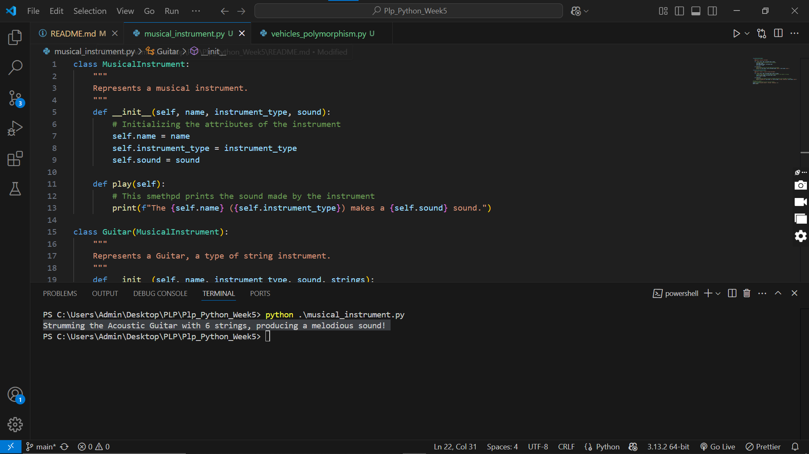
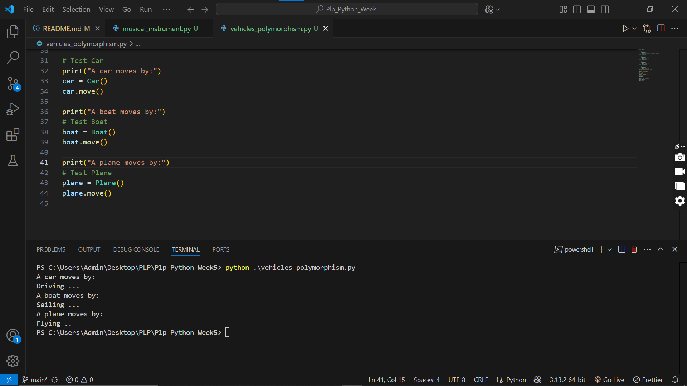

# README

## Project Overview
This project focuses on Object-Oriented Programming (OOP) in Python through class design and polymorphism.

## Implementation Details

### Assignment 1: Custom Class - MusicalInstrument 
**Class: `MusicalInstrument`**
- Represents various musical instruments.
- **Attributes:**
  - `name`: Name of the instrument.
  - `type`: Category (e.g., string, percussion).
  - `sound`: The sound it produces.
- **Methods:**
  - `play()`: Prints a message about playing the instrument.
- **Subclass: `Guitar`**
  - Adds `strings` attribute (number of strings).
  - Overrides `play()` to specify strumming action.

### Activity 2: Polymorphism - Vehicles 🚗✈️⛵
**Class: `Vehicle`**
- Defines a `move()` method to be overridden.
- **Subclasses:**
  - `Car`: Moves by "Driving".
  - `Boat`: Moves by "Sailing".
  - `Plane`: Moves by "Flying".
- Demonstrates polymorphism with a loop calling `move()` on different objects.

